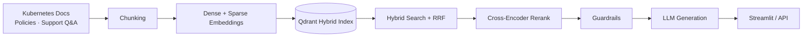

# Verity — Grounded Enterprise RAG Platform

Verity is a Retrieval-Augmented Generation platform that answers questions strictly from an internal knowledge base — Kubernetes documentation, company policies, and IT support Q&A — instead of relying on the LLM's own knowledge. Every answer is grounded in retrieved passages, with guardrails that refuse rather than guess when a question is out of scope or the retrieved context is weak.
## Demo
[demo.mp4]
## Architecture



## Key Features

- **Hybrid retrieval** — dense (BGE) + sparse (BM25) search fused with Reciprocal Rank Fusion, followed by cross-encoder reranking.
- **Guardrails** — a scope check refuses off-topic questions before retrieval; a confidence threshold on the rerank score refuses low-confidence answers after retrieval.
- **Conversational routing** — an intent classifier distinguishes new questions, follow-ups, acknowledgements, and off-topic messages, so the full RAG pipeline only runs when needed.
- **Grounded generation** — the LLM is prompted to answer only from retrieved context and to say what's missing rather than invent an answer.
- **Evaluation** — a RAGAS-style LLM-judge harness scores faithfulness, answer relevance, context precision, and context recall against a gold Q&A set.
- **Two interfaces** — a Streamlit chat UI and a FastAPI backend (`/chat`, `/ask`, `/retrieve`, `/eval`) that Streamlit now calls over HTTP instead of importing the pipeline directly.

## Knowledge Base

Three tiers, each chunked differently: Kubernetes documentation (Markdown, heading-aware recursive chunking with parent-child linkage), company policy documents (Markdown), and IT support Q&A pairs (JSONL, one chunk per pair).

## Tech Stack

LangChain · Qdrant · BGE embeddings · BM25 (FastEmbed) · Sentence-Transformers cross-encoder · OpenRouter LLM · FastAPI · Streamlit · SQLite

## Project Structure

```
.
├── app.py             # Streamlit UI (calls the API)
├── api.py             # FastAPI backend
├── backend_client.py    # HTTP client used by app.py
├── config.py            # Central configuration
├── ingestion.py          # Chunking pipeline
├── embeddings.py          # Dense/sparse embeddings + Qdrant indexing
├── retrieval.py           # Hybrid search, reranking, retrieval eval
├── generation.py          # Prompts, guardrails, routing, generation
├── evaluation.py           # RAGAS-style evaluation
├── cli.py               # CLI entrypoint
└── data/               # Corpus, gold eval set, eval results
```

## Installation

```bash
python -m venv venv
source venv/bin/activate
pip install -r requirements.txt
```

Requires a running Qdrant instance and an `OPENROUTER_API_KEY`:

```bash
docker run -p 6333:6333 qdrant/qdrant
export OPENROUTER_API_KEY=YOUR_API_KEY
```

## Usage

```bash
python cli.py ingest      # chunk the corpus
python cli.py embed       # embed + index into Qdrant
python cli.py eval        # run the evaluation suite
```

Run the API and the UI (separate terminals):

```bash
fastapi dev api.py         # http://localhost:8000/docs
streamlit run app.py       # http://localhost:8501
```

## License

No license file is included in this project.
