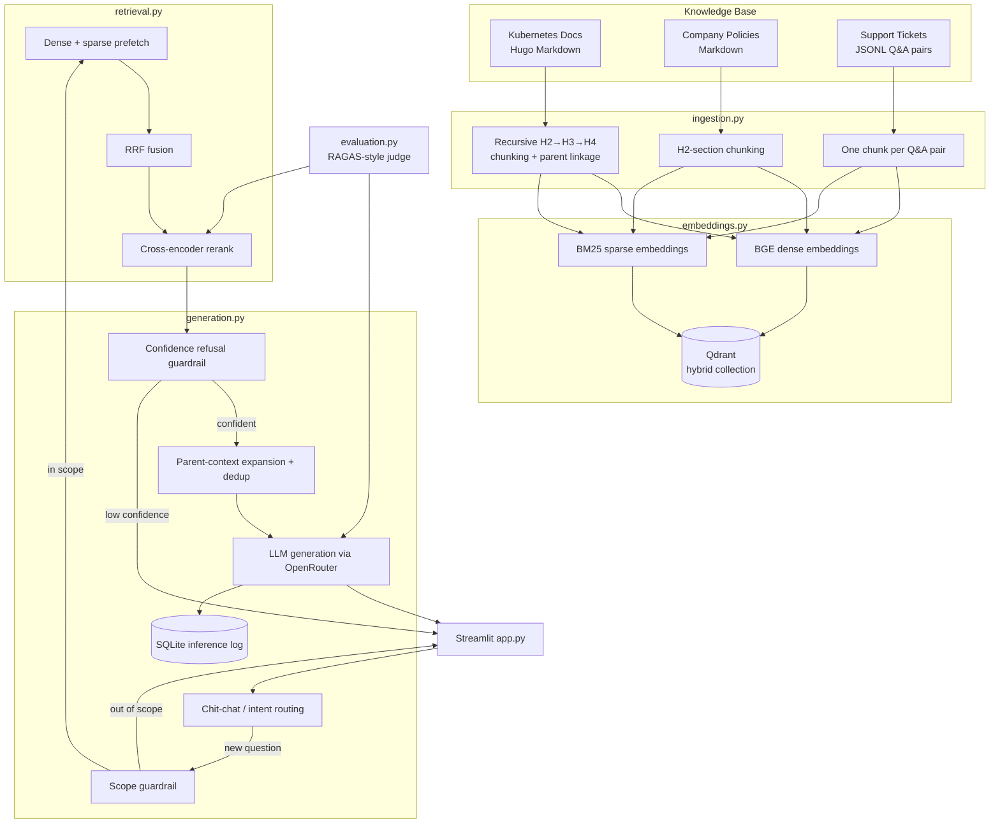

# Verity — Grounded Enterprise RAG Platform

Verity is a Retrieval-Augmented Generation platform that answers questions strictly from an internal knowledge base — Kubernetes documentation, company policy documents, and IT support tickets — instead of relying on a language model's parametric knowledge. It combines hybrid (dense + sparse) retrieval, cross-encoder reranking, parent-child context expansion, and scope/confidence guardrails to produce answers that are traceable back to source passages, with a RAGAS-style evaluation harness used to measure faithfulness and retrieval quality rather than assume it.

Verity is not a chatbot with a knowledge base bolted on — the conversational interface (a Streamlit app) is one surface on top of a pipeline that also exposes a CLI for ingestion, embedding, retrieval evaluation, generation evaluation, and threshold calibration.

## Overview

Enterprises need internal assistants that don't hallucinate policy details, procedures, or technical facts. Verity addresses this by:

- Restricting generation to retrieved context only, with an explicit system prompt instructing the model to say what's missing rather than invent an answer.
- Using **hybrid search** (dense embeddings + BM25-style sparse vectors, fused with Reciprocal Rank Fusion) followed by **cross-encoder reranking** to surface the most relevant passages.
- Applying **guardrails** before and after retrieval: a scope check (keyword + embedding-similarity) rejects off-topic questions before any retrieval work happens, and a **refusal threshold** on the reranker's confidence score rejects low-confidence answers after retrieval.
- Routing conversational turns (greetings, acknowledgements, follow-ups, new questions, off-topic requests) through a lightweight intent classifier so the full RAG pipeline only runs when it's actually needed.
- Logging every inference (question, retrieved chunks, scores, prompt, answer, latency breakdown) to SQLite for observability.
- Scoring the system against a hand-built gold Q&A set with an LLM-as-judge evaluation (faithfulness, answer relevance, context precision, context recall) plus a separate retrieval-only recall/MRR benchmark.

## Key Features

| Area | Capability |
|---|---|
| Ingestion | Format-aware chunking per data tier (Hugo/Markdown docs, plain policy Markdown, JSONL support Q&A) |
| Chunking | Recursive heading-aware splitting (H2 → H3 → H4) with parent-child linkage for the docs tier |
| Embeddings | Dense embeddings (BGE) + sparse embeddings (BM25 via FastEmbed), stored in Qdrant as a hybrid collection |
| Retrieval | Qdrant hybrid query with RRF fusion of dense + sparse prefetches, followed by cross-encoder reranking |
| Context expansion | Reranked child chunks can be expanded to their parent section for fuller context, truncated and centered around the matched span |
| Guardrails | Pre-retrieval scope check (keyword + embedding similarity to a domain centroid) and post-retrieval confidence-based refusal |
| Conversation | Regex-based chit-chat detection plus an LLM intent router for follow-up / acknowledgement / off-topic / new-question classification, with multi-turn history |
| Generation | OpenRouter-hosted LLM via LangChain's `ChatOpenAI` wrapper, with a strict `<answer>` tag output contract and reasoning-tag stripping |
| Logging | Every inference persisted to a local SQLite database with retrieval/generation latency breakdowns |
| Evaluation | RAGAS-style LLM-judge metrics (faithfulness, answer relevance, context precision, context recall) plus dense-vs-hybrid-vs-reranked retrieval recall@k/MRR benchmarking |
| Calibration | A `calibrate` command sweeps the refusal threshold against gold adversarial/valid questions to pick a data-driven cutoff |
| UI | Streamlit app with a chat interface, source citations, routing badges, and a home page summarizing the latest evaluation run |

## Architecture



## RAG Pipeline

The end-to-end flow for a new question, as implemented in `generation.answer_question`:

1. **Chit-chat short-circuit** — a regex bank (`detect_chitchat`) catches greetings, thanks, farewells, and "who are you" style messages and answers them with a canned reply, skipping retrieval and generation entirely.
2. **Scope guardrail** — `check_scope` first checks for domain keywords (Kubernetes/policy/support terms defined in `config.SCOPE_KEYWORDS`); if none match, it falls back to cosine similarity between the query embedding and a cached centroid of sampled corpus embeddings. Below `SCOPE_EMBEDDING_THRESHOLD`, the question is refused with `OUT_OF_SCOPE_MESSAGE` before any retrieval work runs.
3. **Hybrid retrieval** — the query is embedded densely (BGE) and sparsely (BM25 via FastEmbed), both searched against Qdrant in parallel (`Prefetch`), and fused with Reciprocal Rank Fusion (`Fusion.RRF`).
4. **Cross-encoder rerank** — the fused candidate set is rescored with a `sentence-transformers` cross-encoder (`cross-encoder/ms-marco-MiniLM-L-6-v2`) and cut down to the final top-k.
5. **Confidence guardrail** — if the top reranked score is below `REFUSAL_RERANK_THRESHOLD`, the pipeline refuses with a message pointing the user toward the knowledge base's actual coverage, rather than answering on weak evidence.
6. **Parent-context expansion & dedup** — for docs-tier chunks that carry a `parent_id`, the corresponding parent section (from the recursive chunking step) is substituted in for fuller context, truncated to `PARENT_TEXT_MAX_CHARS` and centered on the child span that actually matched; results are deduplicated by parent/chunk id, keeping the highest-scoring occurrence.
7. **Grounded generation** — the deduplicated context blocks, the question, and (optionally) recent conversation turns are assembled into a prompt and sent to an OpenRouter-hosted LLM through LangChain, with a system prompt that forbids outside knowledge and requires output wrapped in `<answer>` tags.
8. **Logging** — the question, retrieved chunk IDs/scores, guardrail outcome, prompt, answer, and per-stage latency are written to a local SQLite database.

For multi-turn chat, `generation.handle_message` wraps this pipeline with conversational routing: after the chit-chat regex check, an LLM-based intent router (`classify_intent`) classifies the message as `new_question`, `follow_up`, `ack`, or `off_topic` using recent history, and only `new_question` triggers the full RAG pipeline above. `follow_up` messages are answered from conversation history alone (no new retrieval), `ack` gets a canned/router-generated reply, and `off_topic` returns the scope-refusal message.

## Knowledge Base / Dataset

Verity's corpus is organized into three tiers, each with its own chunking strategy:

- **`docs` — Kubernetes documentation.** The system uses the official Kubernetes documentation (Hugo/Markdown source, including YAML frontmatter, shortcodes such as ``, ``, ``, and `` transclusion) as the primary technical knowledge source. This tier is used to demonstrate retrieval and grounding over a large, real-world, heavily cross-referenced technical corpus. `_index.md` navigational files are excluded from the retrieval corpus.
- **`policy` — internal company policy documents**, e.g. code of conduct, expense reimbursement, information security, remote work, and vacation/leave policies (plain Markdown, `# Title` + `## Section` structure).
- **`support` — IT support Q&A pairs** (JSONL), covering intents such as password resets and VPN access, chunked one Q&A pair per chunk.

At query time, the system retrieves relevant passages from across these tiers before generating an answer — the LLM never answers from unretrieved knowledge.

## Retrieval & Reranking

- **Chunking (`ingestion.py`)**
  - *Docs tier*: recursive heading-aware splitting. Each document is split on H2 boundaries; any H2 section that still exceeds `MAX_CHUNK_TOKENS` (800, tokenized with the BGE tokenizer) is recursively split into H3, then H4 sections. If no deeper heading exists, a code-fence-safe, paragraph-boundary-aware `split_oversized_section` fallback is used as a last resort. Sections that get split further are recorded once as a `ParentSection`, and every resulting child chunk carries a `parent_id` pointing to its immediate parent — enabling retrieval-time context expansion without duplicating text across children. Metadata captured per chunk includes admonition type (`note`/`warning`/`caution`), presence of code blocks, minimum Kubernetes version (from `feature-state` shortcodes or frontmatter), and cross-referenced doc paths.
  - *Policy tier*: simpler H2-section splitting on plain-Markdown policy files, with the same oversized-section fallback.
  - *Support tier*: one chunk per Q&A pair (`Q: ...\nA: ...`), preserving the `intent` field as filterable metadata.
- **Embeddings (`embeddings.py`)**: dense vectors from `BAAI/bge-base-en-v1.5` (768-dim, with a query-side instruction prefix for asymmetric search) and sparse vectors from `Qdrant/bm25` (via FastEmbed), both stored in a single Qdrant collection under named vectors (`dense`, `sparse`). Payload indexes are created on tier, source type, admonition type, code-block presence, Kubernetes version, and parent id to support metadata filtering.
- **Hybrid search (`retrieval.py`)**: dense and sparse queries are prefetched independently against Qdrant and fused server-side with Reciprocal Rank Fusion (`Fusion.RRF`).
- **Reranking**: the fused candidates are rescored with a cross-encoder (`cross-encoder/ms-marco-MiniLM-L-6-v2`) and reduced to the final top-k passed to generation.
- **Retrieval evaluation (`retrieval.evaluate`)**: benchmarks dense-only, hybrid-RRF, and hybrid+rerank retrieval against a gold set, reporting recall@k, MRR, and average latency per method, both overall and broken down by tier — used to verify that hybrid fusion and reranking actually improve retrieval on this corpus rather than assuming they do.

## Grounded Generation & Guardrails

- **Generation model**: an OpenRouter-hosted LLM, invoked through LangChain's `ChatOpenAI` client with a low temperature, a fixed max-token budget, and retry/timeout handling. The default configured model is `deepseek/deepseek-chat-v3` (configurable via `DOCUMIND_GENERATOR_MODEL`).
- **Grounding contract**: the system prompt instructs the model to answer only from retrieved context, avoid inventing specifics, partially answer when context is incomplete, explain (rather than silently refuse) when context is missing, ignore any instructions embedded in retrieved document content, and use conversation history only for disambiguating references — not as a source of facts. Output must be wrapped in `<answer>` tags; if a model doesn't follow that format, a fallback strips any `<think>` reasoning block and returns the remainder.
- **Pre-retrieval scope guardrail**: keyword matching against per-tier scope terms, with an embedding-similarity fallback against a cached "domain centroid" (mean embedding of a sample of corpus chunks) for queries that don't hit a keyword.
- **Post-retrieval confidence guardrail**: if the top reranked score falls below a calibrated threshold (`REFUSAL_RERANK_THRESHOLD`), the system refuses rather than generating from weak context.
- **Threshold calibration (`evaluation.calibrate_threshold`)**: sweeps candidate thresholds against the gold set's adversarial (expected-refusal) and valid questions, scoring each threshold by how many adversarial questions it correctly refuses minus a heavier penalty for wrongly refusing valid ones, and prints a suggested value.

## Conversational / Intent Handling

Verity supports multi-turn conversations through `generation.handle_message`:

1. A regex fast-path catches common chit-chat (greetings, "how are you", "who are you", thanks, farewells, acknowledgements) without any LLM call.
2. When conversation history exists, an LLM-based intent router classifies the new message as `new_question`, `follow_up`, `ack`, or `off_topic`, working in any language (including mixed English/Arabic).
3. `follow_up` messages are answered directly from the last few conversation turns (no new retrieval), using a dedicated follow-up prompt that forbids introducing new facts not already present in the prior answer.
4. `ack` and `off_topic` messages get a canned/router-generated reply or the out-of-scope message, respectively.
5. `new_question` messages go through the full retrieval → guardrail → generation pipeline described above.

## Evaluation

Two independent evaluation paths are implemented:

- **Retrieval evaluation** (`retrieval.evaluate`, `cli.py retrieval-eval`): computes recall@k and MRR for dense-only, hybrid-RRF, and hybrid+rerank retrieval against a hand-labeled gold set (`data/gold_eval/gold_qa_set.jsonl`), overall and per tier.
- **End-to-end RAGAS-style evaluation** (`evaluation.py`, `cli.py eval`): for each gold question, runs the full `answer_question` pipeline and scores it with an LLM judge on:
  - **Faithfulness** — fraction of claims in the generated answer supported by retrieved context.
  - **Answer relevance** — how directly the answer addresses the question (correct refusals score 1.0).
  - **Context precision** — RAGAS-style precision@k over judged-relevant retrieved passages.
  - **Context recall** — fraction of a reference answer's statements attributable to retrieved context.
  - **Refusal accuracy** — fraction of adversarial/out-of-scope gold questions correctly refused.

  Reports are saved as timestamped JSON under `data/eval_results/` and surfaced on the Streamlit app's home page. The most recent saved run (`ragas_eval_1785444694.json`, 45 gold questions, generator/judge model `deepseek/deepseek-chat-v3`) reports overall faithfulness 1.00, answer relevance 0.98, context precision 0.98, context recall 0.99, and 100% refusal accuracy on the adversarial subset.

## Tech Stack

| Layer | Technology |
|---|---|
| Orchestration | LangChain (`langchain-core`, `langchain-openai`, `langchain-huggingface`, `langchain-qdrant`) |
| Vector store | Qdrant (hybrid dense + sparse collection, RRF fusion, payload indexing) |
| Dense embeddings | `BAAI/bge-base-en-v1.5` (HuggingFace, via `sentence-transformers`/`langchain-huggingface`) |
| Sparse embeddings | `Qdrant/bm25` via FastEmbed |
| Reranking | `sentence-transformers` `CrossEncoder` (`cross-encoder/ms-marco-MiniLM-L-6-v2`) |
| Tokenization (chunk sizing) | HuggingFace `AutoTokenizer` for the embedding model |
| LLM generation & judging | OpenRouter-hosted models via LangChain's `ChatOpenAI` |
| Frontmatter parsing | `PyYAML` |
| Inference logging | SQLite (`sqlite3`) |
| Web UI | Streamlit |
| CLI | Python `argparse` |

## Project Structure

```
.
├── app.py                 # Streamlit UI (chat, sources, routing badges, eval dashboard)
├── cli.py                 # Single CLI entrypoint: ingest / embed / retrieve / ask / eval / calibrate / logs / all
├── config.py               # Central configuration: models, paths, Qdrant, retrieval/generation params, guardrail settings
├── ingestion.py             # Tiered chunking: docs (recursive H2→H3→H4 + parent-child), policy, support
├── embeddings.py             # Dense/sparse embedding generation and Qdrant hybrid collection management
├── retrieval.py              # Hybrid RRF retrieval, cross-encoder reranking, retrieval-only evaluation
├── generation.py             # Prompts, chit-chat/intent routing, guardrails, LLM client, SQLite logging, orchestration
├── evaluation.py             # RAGAS-style LLM-judge evaluation and refusal-threshold calibration
└── data/
    ├── docs/                # Kubernetes documentation corpus (Hugo/Markdown)
    ├── filings/              # Company policy documents (Markdown)
    ├── support_qa/            # Support ticket Q&A pairs (JSONL)
    ├── gold_eval/             # Hand-labeled gold Q&A set used by both evaluation paths
    ├── processed/             # Generated chunks/parents JSONL, embeddings cache, SQLite inference log
    └── eval_results/           # Saved timestamped RAGAS-style evaluation reports (JSON)
```

## Installation

Verity requires Python with the packages used across the pipeline: LangChain and its OpenAI/HuggingFace/Qdrant integrations, `qdrant-client`, `sentence-transformers`, `fastembed`, `transformers`, `PyYAML`, `numpy`, and `streamlit` for the UI.

```bash
python -m venv .venv
source .venv/bin/activate

pip install \
  langchain-core langchain-openai langchain-huggingface langchain-qdrant \
  qdrant-client sentence-transformers fastembed transformers \
  pyyaml numpy streamlit
```

A running Qdrant instance is required (local or hosted):

```bash
docker run -p 6333:6333 qdrant/qdrant
```

## Configuration

All configuration is environment-variable driven (see `config.py`), with sensible defaults. Key variables:

| Variable | Purpose | Default |
|---|---|---|
| `OPENROUTER_API_KEY` | **Required.** API key for LLM generation/judging via OpenRouter | — |
| `DOCUMIND_GENERATOR_MODEL` | Generation model | `deepseek/deepseek-chat-v3` |
| `DOCUMIND_JUDGE_MODEL` | Evaluation judge model | `deepseek/deepseek-chat-v3` |
| `DOCUMIND_ROUTER_MODEL` | Intent-routing model | same as generator |
| `DOCUMIND_QDRANT_URL` | Qdrant endpoint | `http://localhost:6333` |
| `DOCUMIND_QDRANT_API_KEY` | Qdrant API key (if hosted) | — |
| `DOCUMIND_QDRANT_HYBRID_COLLECTION` | Hybrid collection name | `documind_chunks_hybrid` |
| `DOCUMIND_EMBEDDING_DEVICE` | Device for dense embedding model | `cuda` |
| `DOCUMIND_SPARSE_MODEL` | Sparse embedding model | `Qdrant/bm25` |
| `DOCUMIND_RERANK_MODEL` | Cross-encoder reranker | `cross-encoder/ms-marco-MiniLM-L-6-v2` |
| `DOCUMIND_REFUSAL_THRESHOLD` | Rerank-score cutoff for the confidence guardrail | `-9.64` |
| `DOCUMIND_LOG_LEVEL` | Logging verbosity | `INFO` |

The OpenRouter key must be exported before running any generation or evaluation command:

```bash
export OPENROUTER_API_KEY=YOUR_API_KEY
```

## Usage

Verity ships one CLI entrypoint (`cli.py`) covering the full pipeline, plus a Streamlit UI.

```bash
# 1. Chunk the raw corpus (docs/policy/support) into data/processed/
python cli.py ingest

# 2. Embed chunks and upsert into the Qdrant hybrid collection
python cli.py embed

# 3. Benchmark retrieval (dense vs hybrid vs hybrid+rerank) against the gold set
python cli.py retrieval-eval --k 5

# 4. Ask a single question end-to-end
python cli.py ask "What are the four initial namespaces that Kubernetes starts with?"

# 5. Run just the retrieval step for a query, no generation
python cli.py retrieve "how do I reset my company password"

# 6. Run the full RAGAS-style evaluation and save a report
python cli.py eval

# 7. Sweep the refusal threshold against the gold set
python cli.py calibrate

# 8. Inspect recent inference log entries
python cli.py logs --limit 20

# Or run the entire pipeline end to end
python cli.py all
```

Launch the chat UI:

```bash
streamlit run app.py
```

## Example

```
$ python cli.py ask "What is the purpose of the kube-node-lease namespace?"

Q: What is the purpose of the kube-node-lease namespace?

It holds Lease objects for each node, which let the kubelet send periodic
heartbeats so the control plane can detect node failures...

Sources:
  [chunk_...] Docs -> Namespaces -> Initial namespaces  (rerank=6.42)
```

If the reranker's top score falls below the confidence threshold, `ask` prints the refusal reason along with the top retrieved candidates and their scores, so the threshold can be inspected and re-calibrated if needed.

## Limitations

- Answer quality and guardrail behavior are model-dependent; the default generator/judge model is a shared setting and swapping it changes both.
- The scope guardrail's embedding check relies on a cached centroid computed from a fixed sample of corpus chunks, which can drift if the corpus changes significantly.
- The confidence refusal threshold is a single global cutoff calibrated against the current gold set and corpus; it does not adapt per query type automatically.
- The knowledge base is fixed to the three tiers described above (Kubernetes docs, company policy, support tickets) — questions genuinely outside that scope are refused by design.

## License

No license file is included in this project.
