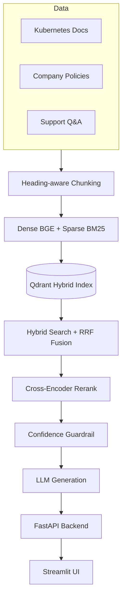

# Verity Grounded Enterprise RAG Platform

Verity is a Retrieval-Augmented Generation platform that answers questions strictly from an internal knowledge base , Kubernetes documentation, company policies, and IT support Q&A .instead of relying on the LLM's own knowledge. Every answer is grounded in retrieved passages, with guardrails that refuse rather than guess when a question is out of scope or the retrieved context is weak. The conversational interface is one part of the system, not the whole of it.

## Demo

https://github.com/user-attachments/assets/9b29cd68-165a-4e1b-85f9-c1cbbd5149a2


## Overview

Enterprises need internal assistants that don't hallucinate policy details or technical facts. Verity addresses this with:

- **Hybrid retrieval** : dense (BGE) + sparse (BM25) search fused with Reciprocal Rank Fusion, followed by cross-encoder reranking.
- **Guardrails**: a pre-retrieval scope check refuses off-topic questions before any retrieval runs; a post-retrieval confidence threshold on the rerank score refuses when retrieved context is weak.
- **Conversational routing**:  an intent classifier distinguishes new questions, follow-ups, acknowledgements, and off-topic messages, so the full RAG pipeline only runs when it's actually needed.
- **Grounded generation** : the LLM is prompted to answer only from retrieved context, ignore instructions embedded in documents, and say what's missing rather than invent an answer.
- **Evaluation** :  a RAGAS-style LLM-judge harness scores faithfulness, answer relevance, context precision, and context recall against a hand-built gold Q&A set, plus a separate retrieval-only recall/MRR benchmark.
- **Two interfaces** :  a Streamlit chat UI and a FastAPI backend, with Streamlit calling the API over HTTP instead of importing the pipeline directly.

## Architecture



## RAG Pipeline

For each new question: **chit-chat short-circuit → scope guardrail → hybrid retrieval → cross-encoder rerank → confidence guardrail → parent-context expansion → grounded generation → logging.**

For multi-turn chat, an LLM-based intent router first classifies the message as `new_question`, `follow_up`, `ack`, or `off_topic`; only `new_question` triggers the full pipeline above, `follow_up` is answered from recent conversation history alone.

## Knowledge Base

Three tiers, each chunked differently:
- **Kubernetes docs** : Hugo/Markdown source, recursively split H2 → H3 → H4, with parent-child linkage for context expansion.
- **Company policies** : plain Markdown, H2-section chunking.
- **Support Q&A** — JSONL, one chunk per Q&A pair.

## Retrieval & Reranking

Dense (`BAAI/bge-base-en-v1.5`) and sparse (`Qdrant/bm25`) vectors are stored together in a Qdrant hybrid collection. At query time, both are searched in parallel and fused with RRF, then the fused candidates are rescored with a `sentence-transformers` cross-encoder (`ms-marco-MiniLM-L-6-v2`) for the final top-k. `retrieval.evaluate` benchmarks dense-only vs. hybrid vs. hybrid+rerank on a gold set (recall@k, MRR) to confirm each stage actually improves results.

## Evaluation

A RAGAS-style harness runs the full pipeline against a gold Q&A set and judges each answer with an LLM on faithfulness, answer relevance, context precision, and context recall, plus refusal accuracy on adversarial/out-of-scope questions. Reports are saved as timestamped JSON and surfaced on the Streamlit home page. The refusal threshold itself is calibrated with a dedicated sweep against the gold set's adversarial and valid questions.


## Tech Stack

| Layer | Technology |
|---|---|
| Orchestration | LangChain |
| Vector store | Qdrant (hybrid dense + sparse) |
| Dense embeddings | BAAI/bge-base-en-v1.5 |
| Sparse embeddings | Qdrant/bm25 (FastEmbed) |
| Reranking | sentence-transformers CrossEncoder |
| LLM generation & judging | OpenRouter (via LangChain) |
| Backend | FastAPI |
| Frontend | Streamlit |
| Logging | SQLite |

## Project Structure

```
.
├── app.py             # Streamlit UI — calls the API, no direct pipeline logic
├── api.py             # FastAPI backend (/chat, /ask, /retrieve, /eval, /logs)
├── backend_client.py    # HTTP client used by app.py to call api.py
├── config.py            # Central configuration
├── ingestion.py          # Tiered chunking (docs / policy / support)
├── embeddings.py          # Dense/sparse embeddings + Qdrant indexing
├── retrieval.py           # Hybrid search, reranking, retrieval evaluation
├── generation.py          # Prompts, routing, guardrails, generation, logging
├── evaluation.py           # RAGAS-style evaluation + threshold calibration
├── cli.py               # CLI entrypoint (ingest / embed / eval / calibrate / ask)
└── data/
    ├── docs/ filings/ support_qa/   # Knowledge base tiers
    ├── gold_eval/            # Hand-labeled gold Q&A set
    └── eval_results/          # Saved evaluation reports
```

## Installation

```bash
python -m venv venv
source venv/bin/activate
pip install -r requirements.txt
```

A running Qdrant instance and an OpenRouter API key are required:

```bash
docker run -p 6333:6333 qdrant/qdrant
export OPENROUTER_API_KEY=YOUR_API_KEY
```

## Usage

```bash
python cli.py ingest      # chunk the corpus
python cli.py embed       # embed + index into Qdrant
python cli.py eval        # run the evaluation suite
```

Run the backend and frontend in separate terminals:

```bash
fastapi dev api.py         # http://localhost:8000/docs
streamlit run app.py       # http://localhost:8501
```

## Limitations

- The scope guardrail relies on a cached embedding centroid of the corpus, which can drift if the corpus changes significantly.
- The confidence refusal threshold is a single global cutoff calibrated against the current gold set.
- The knowledge base is fixed to the three tiers above; questions outside that scope are refused by design.

## License

No license file is included in this project.
